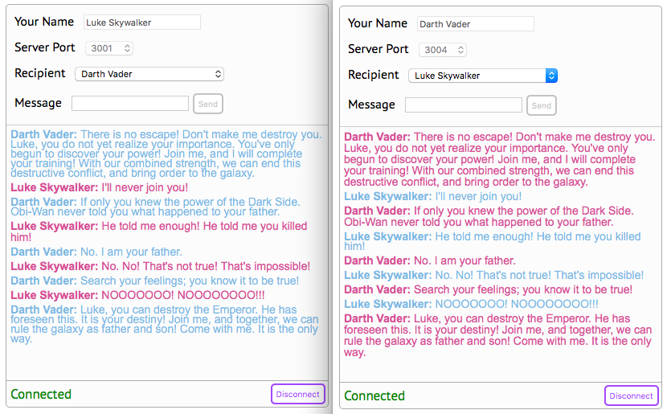

# react-chat-client

## What is this?
A simple React-based chat client for communicating with the 
[node-multi-server-chat](https://github.com/cliffhall/node-multi-server-chat) example.

This client differs from the minimalist one that comes with the server project in a few ways:

  * It lets you log in with any number of different users (instead of the predefined Anna and Billy)
  * It allows you to choose the recipient of each outgoing message from a dropdown of all connected users
  * It displays scrollable message history 

## Setup

### Install Node and npm
[Node](https://nodejs.org/en/download/) 7.7 or above (also installs npm)

### Install Node modules
```cd path/to/react-chat-client``` (the rest of this document assumes you are at this location)

```npm install```

### Initialize server project
For convenience, this project pulls in the [node-multi-server-chat](https://github.com/cliffhall/node-multi-server-chat)
project as a Git submodule. After you run the following command, you'll find that project in the ```server``` folder,
with its node-modules installed.

```npm run init-server```

### Launching Socket Server Instances
Several npm scripts have been defined in ```package.json``` for launching the socket server instances.

#### Inside your IDE
If you're running a modern IDE like Webstorm, you can just open the npm window and double-click on each ```start-server-x``` script. 
A separate integrated terminal will launch and you can monitor each instance's log output.

#### From the command line
In each of four separate terminal windows, enter one of the following commands: 

```npm run start-server-1```

```npm run start-server-2```

```npm run start-server-3```

```npm run start-server-4```

### Launching the Server for the React Chat Client
A simple Express server has been included to serve the React-based chat client, as well as an npm script to launch it.

```npm run serve-react-client```

## Implementation
The goal was to make this project as simple as possible, but toolchain configuration for React projects can be overwhelming 
and hard to follow when you mix in Webpack, Babel, Browserify, etc. Throw architectural abstraction like Redux on top and
beginners may just throw up their hands and walk away.

Fortunately, the scope of this project is small enough that it can be done with the React and ReactDOM libraries alone. 
The only downside is that there is no JSX. 

So instead of:

    render() {
        return (
            <span>
                <label htmlFor="messageInput" 
                       style={labelStyle}>Message</label>
                       
                <input type="text" 
                       name="messageInput" 
                       value={this.props.outgoingMessage} 
                       onChange={this.handleInputChange}/>
            </span>
        );
    }

You'll see what that would actually compile to:

    render() {
        return createElement('span',{},

            // Label
            createElement('label',{
                style: labelStyle,
                htmlFor: 'messageInput'
            }, 'Message'),

            // Text Input
            createElement('input', {
                name: 'messageInput',
                type: 'text',
                value: this.props.outgoingMessage,
                onChange: this.handleInputChange
            })
        );
    }


## Two users chatting 


## TODO

  * Pretty it up with [React-Bootstrap](https://react-bootstrap.github.io/components/alerts/)
  * Support message threads by: 
    - Breaking messages array in to a hash of thread arrays keyed to user name. 
    - Adding a row of tabs over the message history component with a tab for each thread labeled by recipient name.
    - When selecting a tab, the history window should show that thread of messages and the recipient chooser should change automatically.